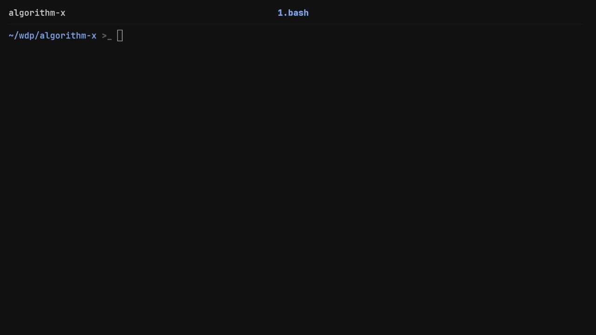

# Algorithm X

A command-line program written in C that solves the **exact cover problem**
using Donald Knuth's Algorithm X (recursive backtracking).

Given a set of elements and a collection of subsets (represented as a matrix),
the program systematically finds combinations of rows where every element is
covered *exactly once*—with no overlaps and no missing pieces.



## How to Run

Run the program:

```bash
./algorithm_x
```

Run the automated test suite (with Valgrind for memory leak checks):

```bash
./tests.sh true
```

### Usage Example

The program takes a filter of `+`/`-` characters followed by a matrix. It finds
combinations of rows that ensure an exact cover, filtering the output based on
the `+` positions.

**Input:**

```text
+ + -
A _ B
_ C _
D E _
```

**Output:**

```text
AC
```

## Technical Highlights

* **Dynamic Memory Management:** Even though the original assignment had capped
input sizes, I wanted to play around with dynamic allocation. The program uses
`malloc` and `realloc` to dynamically scale its memory footprint based on the
input size, applying a doubling strategy to prevent buffer overflows while
keeping overhead low.

* **Recursive Backtracking:** The core exact cover logic is driven by a clean,
straightforward recursive function that explores row combinations and
gracefully backtracks when a collision is detected.

* **Custom Testing Infrastructure:** To ensure the logic was sound and
completely leak-proof, I wrote a custom testing suite.

* `tests.sh` / `test.sh`: Bash scripts that pipe inputs into the compiled
binary, compare outputs via `diff`, and verify memory safety using Valgrind.

* `generate.py`: A Python script to generate exact cover matrices. 
    > Full disclosure: the generator is admittedly a bowl of spaghetti code that
    > only produces sensible test cases because I hand-picked the magic parameters,
    > but it successfully brute-forces the necessary edge cases for validation.*

    The repository contains a lightweight sample of test cases for
    demonstration. The actual codebase was validated against a much larger
    suite of edge cases generated by the script.

## Acknowledgments & License

This project was originally developed for the **Wstęp do Programowania (WDP)**
(Introductory Programming) course at MIMUW (Faculty of Mathematics, Informatics
and Mechanics of the University of Warsaw).

* Course Code: [1000-211bWPI](https://www.google.com/search?q=https://usosweb.mimuw.edu.pl/kontroler.php%3F_action%3Dkatalog2%252Fprzedmioty%252FpokazPrzedmiot%26prz_kod%3D1000-211bWPI%26lang%3Den)

The source code in this repository is my own original work and is licensed
under the [MIT License](./LICENSE).
