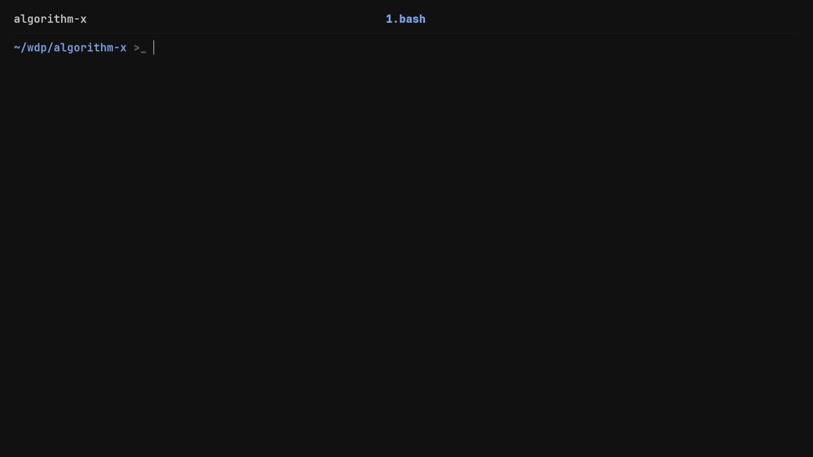

# Algorithm X

A C program that solves the [exact cover problem](https://en.wikipedia.org/wiki/Exact_cover)
using [Donald Knuth's Algorithm X](https://en.wikipedia.org/wiki/Knuth's_Algorithm_X) (recursive backtracking).

Given a set of elements and a collection of subsets (represented as a matrix),
the program systematically finds combinations of rows where every element is
covered *exactly once*, with no overlaps and no missing pieces.


## How to Run

Run the program:

```bash
make algorithm_x
./algorithm_x < input.txt
```

Run the test suite:

```bash
# Run the test suite (fast)
./tests.sh

# Run the test suite with memory leak checks (slower)
./tests.sh true
```

### Usage Example

The program takes a filter of `+`/`-` characters followed by a matrix. It finds
combinations of rows that ensure an exact cover, filtering the output based on
the `+` positions. 
> Note: that the program dynamically infers the matrix dimensions from the
> length of the first line, assuming all subsequent lines are of equal length.

**Input:**

```text
++-
A_B
_C_
DE_
```

**Output:**

```text
AC
```

## Technical Highlights

* **Compiler Constraints & Memory Safety**

    Built to satisfy strict academic requirements , the code compiles cleanly
    under C23 with all warnings treated as errors (`-Werror`) and utilizes
    undefined behavior sanitizers. Additionally, I verified the program's
    memory management using Valgrind to ensure execution without any memory
    leaks.

* **Bounded Dynamic Memory Management** 

    While the assignment's small input limits allowed for simple static arrays,
    I wanted to use this project to practice heap allocation and safe I/O
    handling. I implemented a dynamic memory allocation strategy that reads the
    input on the fly, using malloc and realloc with a doubling strategy to
    scale the buffers. To prevent buffer overflows while keeping memory
    overhead strictly confined, the scaling is deliberately capped at the
    assignment's guaranteed bounds (maximum 300 columns and 200 rows).

* **Recursive Backtracking** 

    The core exact cover logic is driven by a clean, straightforward recursive
    function that explores row combinations and gracefully backtracks when a
    collision is detected.

## Testing Pipeline & Community Validation



To thoroughly validate the recursive backtracking logic and ensure strict
memory safety, I built a custom two-part automated testing pipeline:

* [tests.sh](./tests.sh), [test.sh](./test.sh): 
    Bash scripts that automate the testing execution. They pipe inputs into the
    compiled binary, verify memory safety with Valgrind, and use diff to compare
    the C program's output against the expected results.

* [generate.py](./generate.py): 
    A Python script that algorithmically constructs exact cover matrices to
    serve as complex test cases.

* [solver.py](./solver.py):
    A Python implementation of Algorithm X that acts as the "source of truth,"
    solving the generated matrices to produce the correct expected outputs for the
    test suite.

> Full disclosure: the generator is admittedly a bowl of spaghetti code
> that only produces sensible test cases because I hand-picked the magic
> parameters, but it successfully brute-forces the necessary edge cases for
> validation.

I generated two massive test suites and shared them with my fellow students
to help them validate their own independent projects. Because the Python
generator relied on the same algorithmic logic as my C program, this act of
sharing naturally evolved into a highly useful, symbiotic relationship: my
peers received a robust automated test suite for their assignments, and by
having their independent implementations successfully pass my tests, I
organically cross-validated my own algorithm.

The repository contains a lightweight sample of test cases for
demonstration, but the actual codebase was validated against this much
larger, community-tested suite of edge cases.

## Acknowledgments & License

This project was originally developed for the **Wstęp do Programowania (WDP)**
(Introductory Programming) course at MIMUW (Faculty of Mathematics, Informatics
and Mechanics of the University of Warsaw).

* Course Code: [1000-211bWPI](https://usosweb.mimuw.edu.pl/kontroler.php?_action=katalog2%2Fprzedmioty%2FpokazPrzedmiot&prz_kod=1000-211bWPI&lang=en)

The source code in this repository is my own original work and is licensed
under the [MIT License](./LICENSE).
